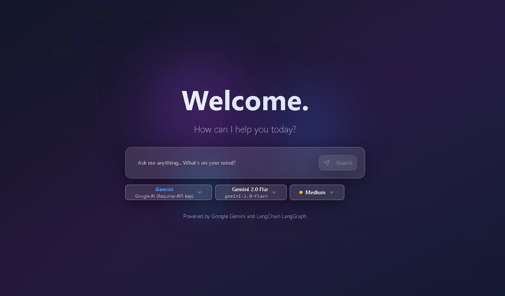
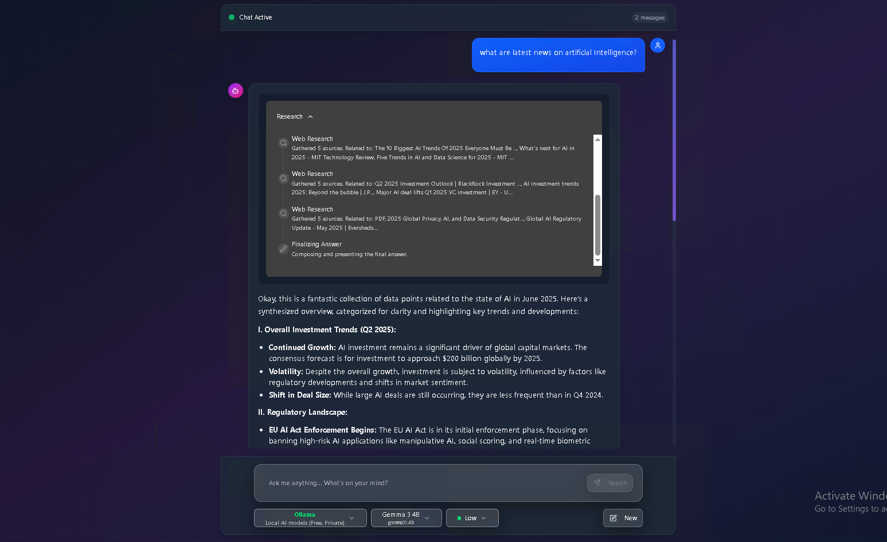

# Gemini Fullstack LangGraph Quickstart - Enhanced Multi-Provider Edition

**🚀 Enhanced version with modern UI, multi-provider LLM support, and Windows compatibility**

This project demonstrates a fullstack application using a React frontend with a modern, professional chatbot interface and a LangGraph-powered backend agent. Originally designed for Google's Gemini models, this enhanced version supports **multiple LLM providers** including Google Gemini, Ollama (for local AI), OpenAI, Anthropic Claude, and Azure OpenAI. The agent performs comprehensive research on user queries by dynamically generating search terms, querying the web using DuckDuckGo search, reflecting on results to identify knowledge gaps, and iteratively refining searches until it can provide well-supported answers with citations.

**Key Enhancements:**
- 🎨 **Modern Chatbot UI** - Professional interface with excellent text visibility and contrast
- 🏠 **Local AI Support** - Ollama integration for privacy-focused local AI models
- 🪟 **Windows Compatibility** - Easy setup with batch files for Windows users
- 🔍 **Free Web Search** - DuckDuckGo integration (no API key required)
- ⚡ **Multi-provider Support** - Use any combination of LLM providers for cost optimization



## Features

- 💬 **Modern Chatbot Interface** - Professional UI with excellent readability and user experience
- 🧠 **LangGraph-Powered Agent** - Advanced research and conversational AI capabilities
- 🏠 **Local AI Support** - Ollama integration for running models locally (privacy-focused)
- 🔍 **Free Web Search** - DuckDuckGo search integration (no API keys required)
- 🌐 **Multi-Provider LLM Support** - Gemini, Ollama, OpenAI, Claude, Azure OpenAI
- 🤔 **Intelligent Research** - Reflective reasoning to identify knowledge gaps
- 📄 **Cited Answers** - Responses include proper citations from web sources
- 🪟 **Windows Ready** - Easy setup with batch files for Windows users
- 🔄 **Hot-Reloading** - Development-friendly with live reload for both frontend and backend


## Quick Start (Windows Users)

**For Windows users, the easiest way to get started:**

1. **Clone the repository:**
   ```bash
   git clone https://github.com/Yaswanth-ampolu/gemini-fullstack-langgraph-quickstart.git
   cd gemini-fullstack-langgraph-quickstart
   ```

2. **Set up environment variables (optional):**
   - Navigate to the `backend/` directory
   - Copy `backend/.env.example` to `backend/.env`
   - Add your API keys (at least one is recommended):
     ```env
     GEMINI_API_KEY=your_gemini_key_here          # Optional but recommended
     OLLAMA_BASE_URL=http://localhost:11434       # For local Ollama models
     OPENAI_API_KEY=your_openai_key_here          # Optional
     ANTHROPIC_API_KEY=your_claude_key_here       # Optional
     ```

3. **Run the application:**
   ```bash
   start-app.bat
   ```

4. **Access the application:**
   - Frontend: http://localhost:5173/app
   - Backend API: http://localhost:2024

The batch file will automatically install dependencies and start both servers in separate windows!

## Getting Started: Manual Setup

**Prerequisites:**
- Node.js and npm (or yarn/pnpm)
- Python 3.8+
- **Optional**: Ollama installed locally for local AI models

**1. Install Dependencies:**

**Backend:**
```bash
cd backend
pip install -e .
```

**Frontend:**
```bash
cd frontend
npm install
```

**2. Environment Setup:**
Create `backend/.env` from `backend/.env.example` and add your API keys:
```env
# At least one provider is recommended (Ollama works without API keys)
GEMINI_API_KEY=your_gemini_key_here          # Recommended for best web search
OLLAMA_BASE_URL=http://localhost:11434       # For local models (free)
OPENAI_API_KEY=your_openai_key_here          # Optional
ANTHROPIC_API_KEY=your_claude_key_here       # Optional
```

**3. Run Development Servers:**

**Option A - Using Make (Linux/Mac):**
```bash
make dev
```

**Option B - Manual (All platforms):**
```bash
# Terminal 1 - Backend
cd backend
langgraph dev --host 0.0.0.0 --port 2024

# Terminal 2 - Frontend  
cd frontend
npm run dev
```

**Option C - Windows Batch File:**
```bash
.\start-app.bat
```

## Multi-Provider LLM Support

This application supports multiple LLM providers for enhanced flexibility:

### Supported Providers

| Provider | Models | API Key Required | Best For |
|----------|--------|------------------|----------|
| **Ollama** | `llama3.1:8b`, `llama3.2`, `qwen2.5` | ❌ No (Local) | Privacy, Free usage |
| **Google Gemini** | `gemini-2.0-flash-exp`, `gemini-1.5-pro` | ✅ Yes | Web search, Fast responses |
| **OpenAI** | `gpt-4o`, `gpt-4o-mini`, `gpt-3.5-turbo` | ✅ Yes | High quality, Reliable |
| **Anthropic Claude** | `claude-3-5-sonnet`, `claude-3-5-haiku` | ✅ Yes | Reasoning, Analysis |
| **Azure OpenAI** | `gpt-4o`, `gpt-35-turbo` | ✅ Yes | Enterprise |

### Ollama Setup (Recommended for Local AI)

1. **Install Ollama:** Download from [ollama.com](https://ollama.com)
2. **Pull a model:**
   ```bash
   ollama pull llama3.1:8b
   ```
3. **Verify it's running:**
   ```bash
   ollama list
   ```
4. **Use in the app:** Select "Ollama" provider and "llama3.1:8b" model

## How the Research Agent Works


The LangGraph agent follows this intelligent research process:

1. **Query Analysis** - Understands your question and generates targeted search queries
2. **Web Research** - Searches the web using DuckDuckGo (free, no API key needed)
3. **Content Analysis** - Analyzes search results and identifies knowledge gaps
4. **Iterative Refinement** - Generates follow-up searches if more information is needed
5. **Synthesis** - Combines all findings into a comprehensive answer with citations

## Modern UI Features

The frontend features a professional, modern chatbot interface:

- **High Contrast Design** - Excellent text visibility and readability
- **Message Bubbles** - Distinct styling for user and AI messages with avatars
- **Real-time Activity** - Live updates showing research progress
- **Responsive Design** - Works perfectly on desktop and mobile
- **Copy Functionality** - Easy copying of AI responses
- **Provider Selection** - Switch between different AI providers seamlessly

## 🔍 Web Research Agent Flow



This diagram shows the chatbot's intelligent web research flow:  
1. Understands the query and generates relevant searches  
2. Gathers and analyzes web content to identify key facts  
3. Iteratively refines results for accuracy and depth  
4. Synthesizes everything into a clear, cited response


## Deployment

**Docker Deployment:**

1. **Build the image:**
   ```bash
   docker build -t gemini-fullstack-langgraph -f Dockerfile .
   ```

2. **Run with docker-compose:**
   ```bash
   GEMINI_API_KEY=<your_key> LANGSMITH_API_KEY=<your_key> docker-compose up
   ```

3. **Access:** http://localhost:8123/app/

## Technologies Used

- **Frontend:** React, Vite, Tailwind CSS, Shadcn UI
- **Backend:** LangGraph, FastAPI, Python
- **AI Providers:** Google Gemini, Ollama, OpenAI, Anthropic Claude
- **Search:** DuckDuckGo (free, no API key required)
- **Development:** Hot-reload, TypeScript, Modern tooling

## Repository

🔗 **GitHub:** [https://github.com/Yaswanth-ampolu/gemini-fullstack-langgraph-quickstart](https://github.com/Yaswanth-ampolu/gemini-fullstack-langgraph-quickstart)

## License

This project is licensed under the Apache License 2.0. See the [LICENSE](LICENSE) file for details.

---

**⭐ Star this repository if you find it helpful!**
